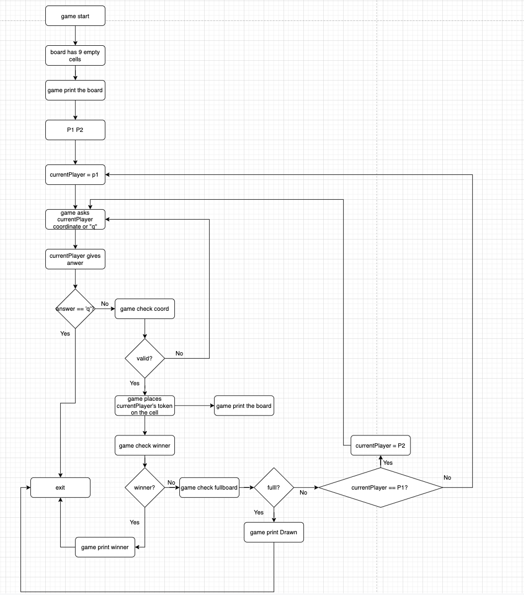
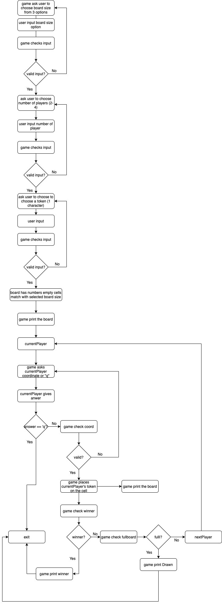
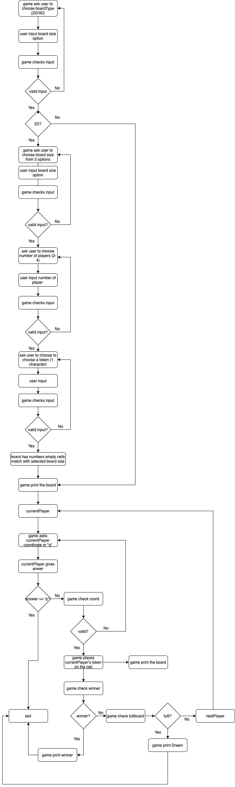
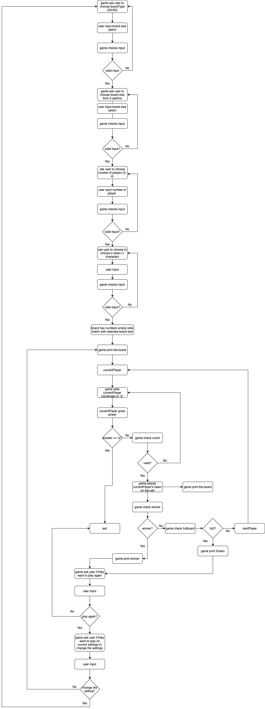

#Tic Tac Toe Console Game
 
**Part 1: Basic 2D Tic Tac Toe**
- User can play on 3x3 Board with 2 token X & Y.
- [Requirement](https://github.com/MYOB-Technology/General_Developer/blob/main/katas/kata-foundational/foundational-kata-tictactoe.md)   
- [Code](https://github.com/myob-fma/tiffany-kata-tic-tac-toe/commit/c2bb36b298c53bb9b2696fe58dac353955423157)

**Part 2: Custom 2D Tic Tac Toe**
- Allow user to choose board size, number of players, token   
- [Code](https://github.com/myob-fma/tiffany-kata-tic-tac-toe/commit/d59e5836d40ee1dd5bfa78786d99f040eece87e3)

**Part 3: Add 3D Tic Tac Toe**
- Allow user to choose board type (2D or 3D)
- Allow user to choose board size, number of players, token   
- Allow user to player again with current settings or change the settings   
- [Code](https://github.com/myob-fma/tiffany-kata-tic-tac-toe/tree/3D-tic-tac-toe)

